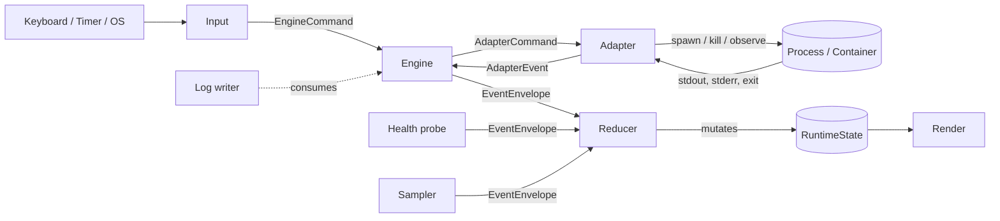
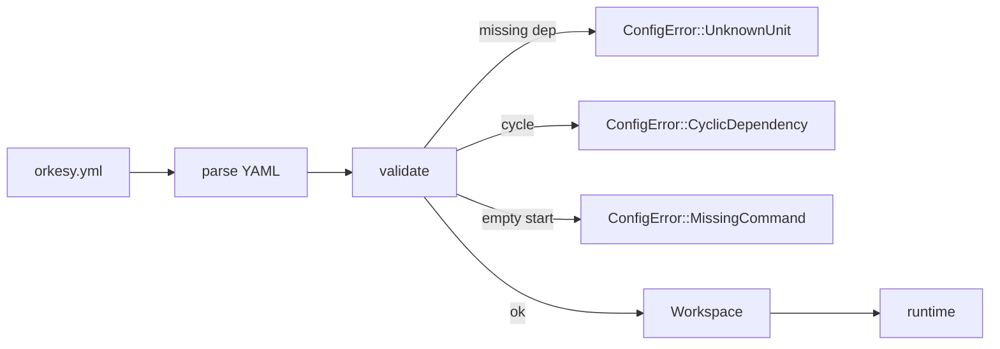

# Architecture

How Orkesy is put together, and why the contentious choices are the way they are.

---

## Crate boundaries

Two crates:

```
orkesy-core/   pure library — no I/O, no terminal
orkesy-cli/    binary `orkesy` — TUI, engines, adapters, health, samplers
```

`orkesy-core` owns the data model, the reducer, the config schema, and the metrics state. It uses `tokio` only for channel types in trait definitions; it does not start a runtime. The one I/O affordance is `OrkesyConfig::load`, which reads a YAML path off disk.

`orkesy-cli` owns everything that touches the outside world: rendering (`ratatui` + `crossterm`), engines (`local_process`, `docker`, `fake`), adapters (process, docker), health probes, project detectors, the `init`/`migrate`/`doctor` subcommands, and the persistent log writer.

If a piece of code touches the OS, the terminal, or the network, it belongs in `orkesy-cli`. Otherwise it belongs in `orkesy-core`.

---

## Runtime data flow

Event-sourced and unidirectional:



The contract:

- **Events go one way.** Anything that affects state is wrapped in `EventEnvelope { id, at, event }` and applied via `reduce(&mut RuntimeState, &EventEnvelope)`.
- **The reducer is pure.** Same state + same event → same next state. No I/O, no clock reads.
- **The renderer is read-only.** It reads a snapshot of state and produces a frame.

This makes the reducer trivially testable and isolates the gnarly async work at the edges.

---

## Core types

```rust
// model.rs
enum ServiceStatus  { Unknown, Starting, Running, Stopped, Exited{code}, Restarting, Errored{message} }
enum HealthStatus   { Unknown, Healthy, Degraded{reason}, Unhealthy{reason} }
struct ServiceNode  { id, display_name, kind, desired, observed, port, description }
struct RuntimeGraph { nodes: BTreeMap<ServiceId, ServiceNode>, edges: BTreeSet<Edge> }

// state.rs
struct RuntimeState {
    graph, logs, metrics, last_event_id,
    project, runs, run_order, metrics_series,
}
```

`RuntimeGraph` is the **declared** shape — what's in `orkesy.yml`. `RuntimeState` is the **observed** shape — what's actually happening. The reducer mutates the latter; the former is loaded once and held by reference.

---

## Engines and adapters

Two layers, deliberately:

- An **engine** owns a runtime topology and a strategy. It consumes `EngineCommand` (Start/Stop/Restart/Kill/…) and emits `EventEnvelope`. Three are shipped: `local_process` (default, child processes via `tokio::process`), `docker` (feature-gated, via `bollard`), and `fake` (demo / test).
- An **adapter** runs a single unit. `ProcessAdapter` and `DockerAdapter` translate `AdapterCommand` into actual work and observable side effects (`stdout`, exit codes, container events) into `AdapterEvent`.

The split lets us reuse adapters across engines and lets engines compose cross-cutting behaviour (start order, restart policy, dependency gating) without duplicating spawn code. Adapter events become runtime events at the engine boundary — see `adapter_event_to_runtime` in `orkesy-cli/src/main.rs`.

---

## Log store

Three bounded ring buffers in `orkesy-core/src/state.rs`:

| Buffer | Purpose | Cap |
|---|---|---|
| `per_service: BTreeMap<ServiceId, VecDeque<LogLine>>` | per-unit history | 10 000 lines |
| `merged: VecDeque<LogLine>` | cross-service stream | 10 000 lines |
| `per_run: BTreeMap<RunId, VecDeque<LogLine>>` | bounded per-run buffer | 10 000 lines |

Levels are not stored — they are detected on demand by `log_filter::detect_level` so the heuristic can change without rewriting history. Caps are constants; they become configurable when persistent history grows.

---

## Metrics

`MetricsState` (`orkesy-core/src/metrics.rs`) holds time-series rings: `Series { cap, points: VecDeque<(t, v)> }`. Default 60-second window at 1 Hz (cap = 120). Three sources: system-wide samples from `sampler.rs`, per-service samples from the same sampler scoped to PIDs, and a log-rate sample derived inside the reducer. The renderer reads `MetricsState` directly and feeds it to `ratatui::widgets::Chart` — no copying.

---

## Config

YAML, canonical schema is `units:`:

```yaml
version: 1
project: { name: my-app }
units:
  api:
    kind: process
    start: "npm run dev"
    port: 3000
edges:
  - { from: api, to: db, kind: depends_on }
log_history:
  enabled: false
```

### Loading pipeline



Discovery: `$ORKESY_CONFIG`, then `orkesy.yml` / `orkesy.yaml` / dotted variants walking up from cwd. Validation refuses unknown edge endpoints, cycles in `depends_on`, and empty `start` commands. Errors are typed and name the offending unit.

### Legacy schema

An older `services:` form parses as a fallback and converts internally to the same `Workspace`. `orkesy migrate` rewrites such files to the canonical form, with a timestamped `.bak` of the original.

---

## Persistent log history

Opt-in via `log_history.enabled: true`. The writer subscribes to the `RuntimeEvent` broadcast as a separate consumer and appends JSONL to per-project, per-hour files:

```
$XDG_STATE_HOME/orkesy/projects/<project-hash>/
├── meta.json                    # format version, project name, root
└── logs/
    └── 2026-04-30T14.jsonl      # one record per line
```

JSONL record:

```json
{"t":1714492801.234,"u":"api","s":"stderr","l":"error","m":"connect ECONNREFUSED 127.0.0.1:5432"}
```

Read path: `orkesy logs <unit> --since <duration> --level <…> --format <text|json>` streams matching files, applies filters in-process, and prints. The reducer's fast path is unchanged — disk writes never block in-memory state mutation.

---

## CLI structure

```
orkesy-cli/src/
├── main.rs            # entrypoint, argument parsing, runtime wiring, tui_loop
├── app.rs             # UiState, View, Focus, LogsUiState, …
├── input.rs           # TuiCommand, parse_command
├── render.rs          # icons, styles, fit_title, format_timestamp
├── log_history.rs     # writer + reader for persisted logs
├── views/             # extracted render helpers
│   ├── command_palette.rs   # picker model + modal renderer
│   ├── footer.rs            # tabs + context hints + global keys
│   ├── help.rs              # help overlay
│   ├── search_bar.rs        # logs search overlay
│   └── status_bar.rs        # top status bar
├── runner.rs          # ad-hoc command runner
├── sampler.rs         # background metrics collection
├── health.rs          # HTTP / TCP / exec probes
├── adapters/          # ProcessAdapter, DockerAdapter
├── engines/           # local_process, docker, fake
├── detectors/         # node, python, rust, go, docker
├── commands/          # init, doctor, migrate
└── ui/                # theme, styles
```

The bulk of the inline TUI rendering and key handling still lives in `tui_loop` in `main.rs`. See "Key Decisions & Tradeoffs" below.

---

## Threading

Tokio multi-threaded. `RuntimeState` lives in an `Arc<RwLock<…>>`; the reducer task holds the only writer, every other task holds readers. Channels:

- `mpsc::Sender<EngineCommand>` — UI → engine
- `broadcast::Sender<EventEnvelope>` — engine / health / sampler → reducer + UI + log writer
- `mpsc::Sender<AdapterCommand>` — engine → adapter
- `broadcast::Sender<AdapterEvent>` — adapter → engine

Broadcast means slow consumers (renderer, log writer) can lag without backpressuring producers; the renderer redraws the world from state on every tick anyway, and the log writer logs a warning on cumulative drops.

---

## Key Decisions & Tradeoffs

### Why logs are JSONL, not a database

JSONL survives `grep`, `jq`, `tail -f`, and any text editor. Readers can ignore unknown fields, so the format is forward-compatible. A SQLite alternative would buy us indexed queries but cost a non-trivial dependency and a single-writer file lock that complicates concurrent Orkesy invocations against the same project. JSONL plus a sparse offset index gets ~90% of the value at ~10% of the complexity.

### Why no external dependencies were added for log history

Adding `chrono`/`time` for one date-formatting helper or `sha2` for one stable hash would have been the easy path. We wrote ~20 lines of `civil_from_days` and a 9-line FNV-1a instead. The total dependency tree is part of what users build and audit — every dep is a maintenance commitment, and the bar is "is this strictly required?".

### Why log history is opt-in

It writes to disk, in a per-user directory, on every log line. That's a real side effect even when bounded by retention. The default for a tool that runs alongside other things on a developer machine should be "does nothing surprising". Users opt in by setting `log_history.enabled: true` after they've decided they want it.

### Why batching + hourly files

Hourly files trade a small write-amplification for trivially correct rotation: deleting last week's logs is `find -mtime +7 -delete`, and the file name *is* the time bucket. Within a file, we batch flushes (every 1000 lines or 5 seconds) so the live path doesn't pay an `fsync` per line. The cost is up to 5 s of logs lost on power failure — acceptable for a dev tool, not acceptable for a production pipeline (which is not what this is).

### Why config migration exists

Two schemas (`services:` and `units:`) coexisted for historical reasons. Rather than a hard cut that breaks anyone's checked-in `orkesy.yml`, `orkesy migrate` rewrites it in place, leaves a timestamped `.bak` next to the original, and is idempotent. The legacy parser stays in for one minor version with a load-time warning, then we cut it.

### Why TUI loop was not fully refactored

The TUI's event loop, key handling, and inner view rendering are about 3,300 lines living inside one `tui_loop` function. The render-block periphery (status bar, footer, help, search, command palette modal) was extracted cleanly into `views/*` because each block had a small, identifiable input contract. The interior cannot move without first defining a real `AppState` type with `handle_key` / `tick` / `render` methods — that is a deeper rewrite than we'd do without being able to verify the TUI behaviour by hand. The four `clippy::*` allows in `main.rs` mark the same boundary; the placeholder modules (`views/{units,logs,metrics}.rs`) name the destinations.

This is in-flight technical debt, not a steady state. It is documented here so a reader doesn't go looking for clean separation that doesn't yet exist.

### Why bounded log buffers in memory, persistence as a separate system

The hot path (logs view, search, filtering) needs `O(1)` writes and bounded memory. A ring buffer is right for that. Persistent history needs disk, retention, indexing, query — a different shape. Conflating them — say, mmap'd files for everything — would slow the hot path and complicate the cold path. They are separate systems that share an event stream.

### Why local-first instead of Kubernetes-first

The pain we are solving is local development friction: too many terminals, scripts that drift, no shared view of what's running. A cluster control plane does not solve that. Local-first lets us assume one user, one filesystem, no auth, no rolling updates — and the code that exploits those assumptions is dramatically simpler. A future Kubernetes engine slots in as one engine among several behind the existing trait, not as a redesign.

---

## Where to start reading

If you have ten minutes:

1. `orkesy-core/src/model.rs` — the data model (~80 LOC)
2. `orkesy-core/src/reducer.rs` — the reducer arms
3. `orkesy-cli/src/main.rs::run_tui` — wiring
4. `orkesy-cli/src/engines/local_process.rs` — a real engine

If you want to extend it:

- **Add a unit kind** → new `Adapter` impl + register it.
- **Add a health probe** → extend `HealthCheck` enum, implement in `health.rs`.
- **Add a detector** → new module under `detectors/` returning `Vec<DetectedUnit>`.
- **Add a TUI view** → extract from `tui_loop` into a new `views/<name>.rs` (see the in-flight debt note above), wire keys via `input.rs`.

---

## Testing

- **Reducer tests** — pure data-in / data-out, no async, no mocks. Live in the same files as the code.
- **Config tests** — parse → assert graph shape; parse bad input → assert specific `ConfigError` variants. Example configs are smoke-tested in `orkesy-core/tests/example_configs.rs`.
- **Adapter / engine tests** — prefer the `fake` engine for end-to-end TUI behaviour. The real adapters are exercised by integration tests against `sleep` / `echo`.
- **Log history tests** — writer and reader round-trip in `orkesy-cli/src/log_history.rs::tests`.
